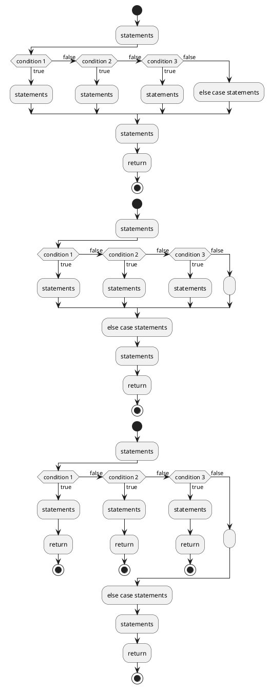

```plantuml
@startuml
start
    :statements;
if(condition 1) then(true) 
    :statements;
(false) elseif (condition 2) then(true) 
    :statements;
(false) elseif (condition 3) then(true)
    :statements;
else (false)
    :else case statements;
endif
    :statements;
    :return;
stop

start
    :statements;
if(condition 1) then(true) 
    :statements;

(false)elseif (condition 2 ) then(true) 
    :statements;
(false)elseif (condition 3) then(true) 
    :statements;
else (false)
    :;
endif
    :else case statements;
    :statements;
    :return;
stop

start
    :statements;
if(condition 1) then(true) 
    :statements;
    :return;
    stop
(false)elseif (condition 2 ) then(true) 
    :statements;
    :return;
    stop
(false)elseif (condition 3) then(true) 
    :statements;
    :return;
    stop
else (false)
    :;
endif
    :else case statements;
    :statements;
    :return;
stop


@enduml
```